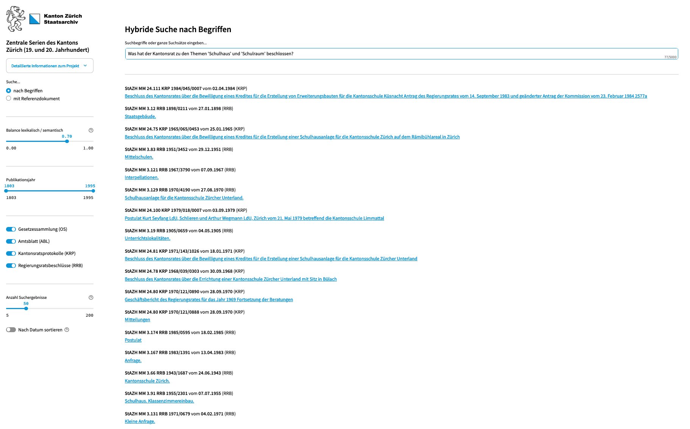

# Intelligent Document Search for the Staatsarchiv Zurich

**Enhance access to the central collections of the Staatsarchiv Zürich with an intelligent hybrid search application.**

Contents

- [Usage](#usage)
- [Project Information](#project-information)
- [What Does the App Do?](#what-does-the-app-do)
- [Findings](#findings)
- [Project Team](#project-team)
- [Contributing](#feedback-and-contributing)

## Usage

This repository provides the production-ready code for our search app, which is available online [here](https://www.zentraleserien-hybridesuche.zh.ch/).

To set up the app:

[Install uv](https://docs.astral.sh/uv/getting-started/installation/) for environment management.

- Clone this repository.
- Change into the project directory: `cd ai-search_staatsarchiv/`
- Install the required packages: `uv venv` and then `uv sync`

### Run the Notebooks to Prepare the Data

- Run the notebooks. Open them either in an IDE like [Visual Studio Code](https://code.visualstudio.com/). Alternatively, you can use [Jupyter Notebook](https://docs.jupyter.org/en/latest/running.html) or [Jupyter Lab](https://jupyter.org/install).
- Use the final notebook to create the [Weaviate](https://weaviate.io/developers/weaviate/installation/embedded) search index. Data is stored by default in `.local/share/weaviate/`. If you are deploying the app on a remote machine, copy the index data to the same path on the remote machine, or change the path in the app like so:
  `client = weaviate.connect_to_embedded(persistence_data_path="/your_data_path_on_your_vm/")`.

### Run the Search App

- Start the app: `uv run streamlit run _streamlit_app/hybrid_search_stazh.py`

> [!Note]
> The app logs user interactions locally to a file named `app.log`. If you prefer not to collect analytics, simply comment out the relevant function call in the code.

### Embedding Model

For the embeddings, we use [Jina AI's](https://jina.ai/) model [jina-embeddings-v2-base-de](https://huggingface.co/jinaai/jina-embeddings-v2-base-de). The model is a German/English bilingual text embedding model supporting 8,192 sequence length. 

According to the model card, it is designed for «high performance in mono-lingual & cross-lingual applications and trained … specifically to support mixed German-English input without bias». Technical report [here](https://arxiv.org/abs/2402.17016).

Note that we chunk all text on a sentence basis to a maximum of 500 tokens with a 100-token overlap.

## Project Information

The [Staatsarchiv Zürich](https://www.zh.ch/de/direktion-der-justiz-und-des-innern/staatsarchiv.html) manages and catalogs the «Zentralen Serien des Kantons Zürich 19. und 20. Jahrhundert», which includes important historical documents such as minutes from the Cantonal Council, Government Council resolutions, collections of laws, and the Official Gazette. These records span from 1803 to the present, making them linguistically and thematically diverse.

We (the Staatsarchiv and the [Statistical Office](https://www.zh.ch/de/direktion-der-justiz-und-des-innern/statistisches-amt.html)) developed an intelligent search application that enhances access to these extensive archives.

For more information, see the following article in the magazine ABI Technik: <a href="https://www.degruyter.com/document/doi/10.1515/abitech-2025-0003/html" target="_blank">Mit Künstlicher Intelligenz zu besserer Nutzbarkeit: Die Zentralen Serien des Kantons Zürich (19. und 20. Jahrhundert) neu zugänglich gemacht</a>

## What Does the App Do?

This app allows users to search through these extensive archives using both lexical and semantic search methods. Unlike traditional lexical search that looks for exact keywords, semantic search identifies words, sentences, or paragraphs with similar meanings, even if they don't exactly match the search term. For example, a search for «technology» might return documents containing related concepts like «digitalization», «artificial intelligence», «software development», or «computer science» even if «technology» isn't mentioned directly.

Additionally, semantic search can retrieve documents related to a reference text. For instance, entering a document reference like RRB 1804/1 will return documents with similar themes.

Semantic search leverages statistical methods and machine learning to analyze large text corpora, allowing models to learn word and sentence similarities, enabling more nuanced document retrieval. While semantic search offers significant benefits, results can sometimes be incomplete or include irrelevant matches.

## Findings

- **Hybrid search significantly improves search results compared to traditional lexical search**, especially for complex or fuzzy queries and large corpora spanning over two centuries.
- The embedding models we tested (and the one we use in the app) are astonishingly agnostic to the historical language used in the documents. Based on our observations, these models can capture the semantic meaning of very old texts as well.
- [Weaviate](https://weaviate.io/) has proven to be a reliable and efficient tool for semantic search. It is easy to use and integrates well with Python.
- The app is inexpensive to run and maintain. It can be deployed on a local machine or a virtual machine with moderate resources. At the moment, we use a VM with 8 CPUs and 32 GB RAM.

## Project Team

**Rebekka Plüss** (Staatsarchiv) and **Patrick Arnecke** (Statistisches Amt, Team Data). A big thanks goes to **Sarah Murer** and **Dominik Frefel** as well.

## Feedback and Contributing

We welcome your feedback. Please share your thoughts and let us know how you use the app in your institution. You can [email us](mailto:staatsarchivzh@ji.zh.ch) or contribute by opening an issue or a pull request.

Please note that we use [Ruff](https://docs.astral.sh/ruff/) for linting and code formatting with default settings.

## License

The software in this project is licensed under the MIT License. See the [LICENSE](LICENSE) file for details.

## Disclaimer

This software (the Software) incorporates open-source models (the Models) from providers like Huggingface. The app has been developed according to and with the intent to be used under Swiss law. Please be aware that the EU Artificial Intelligence Act (EU AI Act) may, under certain circumstances, be applicable to your use of the Software. You are solely responsible for ensuring that your use of the Software as well as of the underlying Models complies with all applicable local, national and international laws and regulations. By using this Software, you acknowledge and agree (a) that it is your responsibility to assess which laws and regulations, in particular regarding the use of AI technologies, are applicable to your intended use and to comply therewith, and (b) that you will hold us harmless from any action, claims, liability or loss in respect of your use of the Software.
